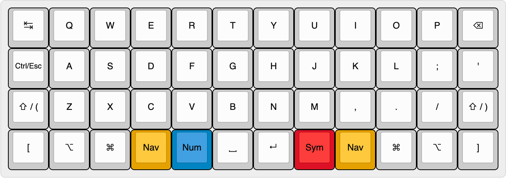
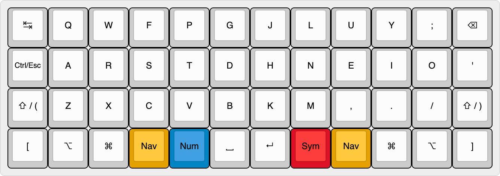
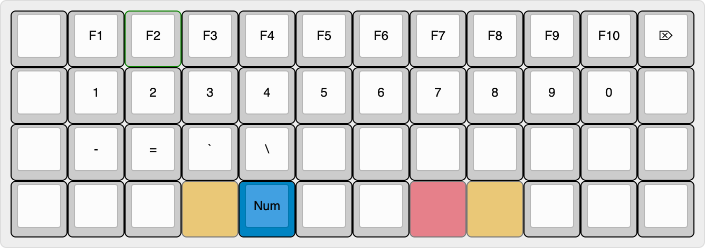
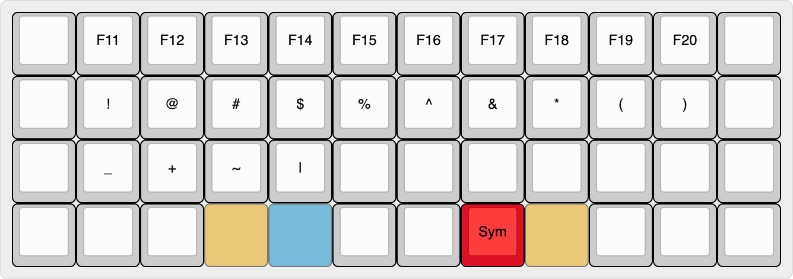
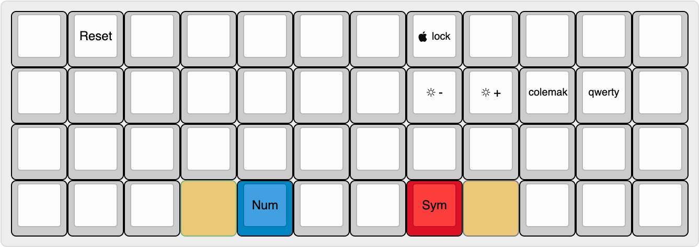
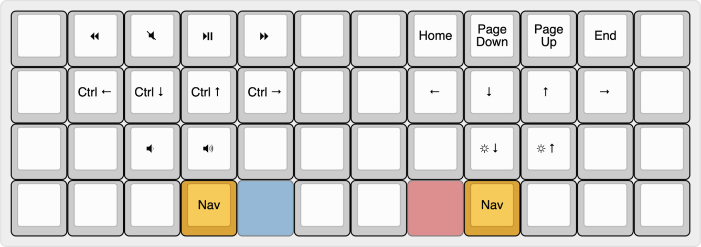

# Planck keyboard layout

Layout for my [Planck keyboard (rev. 4)][planck] that I have been using and
improving since 2017. It uses the awesome [QMK firmware][qmk]. I had the
following goals while creating it:

* Support for both the Qwerty and [Colemak](https://colemak.com/) layouts
* Easy access to commonly used programming symbols, most importantly `(`/`[`/`{`
* Symmetric (left/right) modifier keys whenever possible
* Quick access to escape for Vim usage
* Use of tap/hold functionality to access keys quickly (tap key for symbol, hold
  for modifier)

## Layout

The layout is split into different layers: two base layers for either Qwerty or
Colemak, and several overlay layers activated by holding some of the four
colored layer toggle keys. For the latter, the toggle keys required to access
the layer are shown, while the others are faded out. All non-labeled keys
inherit the functionality from the base layer.

All layout images where created using [keyboard-layout-editor.com][kle].
Permalink's to the layouts can be found at the bottom of this readme.

### Qwerty base layer

Base layer using the Qwerty layout. Both shift keys as well as the control key
function as the respective modifiers when held, but output a parenthesis or
escape respectively when tapped. Ideally, the `'` key would also function as a
control key when held, however this causes technical problems: quickly using
shift combined with `'` sometimes causes `('` to be output rather than `"`.
While QMK provides several settings related to the tap/hold functionality, I
have not found a combination that works reliably in this case. Unfortunately,
neither backspace (often held for key repeat) nor `]` (often used with shift)
are good candidates for a right side control key either.

### Colemak base layer

Same as the Qwerty layer except with Colemak layout for the center part.

### Number layer

Accessed by holding the blue number layer key.  Provides access to the number
keys directly on the home row, with the respective F keys directly above. Also
provides the four other keys commonly found on the number row as well as a
delete key in place of the standard backspace.

### Symbol layer

Accessed by holding the red symbol layer key, it contains shifted versions of
the keys in the number layer so that they can be used with only a single
modifier key. The two parenthesis on 9 and 0 are provided for completeness only,
they should be accessed using the two shift keys in the base layers instead. The
F keys from the number layers are replaced by their counterparts ten numbers
higher.

### Adjust layer

Provides access to keyboard settings (backlight brightness, Qwerty vs. Colemak,
reset for flashing), as well as other shortcuts that should be a bit more
difficult to access to avoid accidental activations. Accessed by holding both
the blue number and red symbol key.

### Navigation layer

Several clusters of movement keys, each in the traditional Vim layout (although
the arrow keys are shifted right by one key to be directly under the default
home row keys for the right hand). Can be accessed using either of the yellow
navigation layer keys. The arrow keys including control are used to navigate
between desktops/fullscreen windows in macOS. Also includes media controls
(play/pause, previous, next) in a similarly laid out cluster.

## Building

One way to build the keymap is to follow the instructions in the
[QMK docs][qmk-docs], copying the `keymap` directory into the QMK installation.

To avoid installing any tools globally, this repo contains a makefile that only
uses the QMK version included as a submodule as well as the `qmk` CLI installed
using pipenv. It works by symlinking the `keymap` directory at the right place
in the `qmk` submodule directory.

To use it, install the `qmk` CLI using `pipenv install`, as well as any QMK
dependencies, such as a cross-compiler and dfu-programmer (you can also just run
the build and install dependencies as they are reported missing). Then run
`make build` to build the firmware and `make flash` to flash it onto a Planck in
reset mode.

## Layouts on keyboard-layout-editor.com

* [Qwerty base layer](http://www.keyboard-layout-editor.com/##@@_a:7%3B&=%E2%86%B9&=Q&=W&=E&=R&=T&=Y&=U&=I&=O&=P&=%3Ci%20class%2F='mss%20mss-Unicode-BackSpace-DeleteLeft-Big-2'%3E%3C%2F%2Fi%3E%3B&@_f:2%3B&=Ctrl%2F%2FEsc&_f:3%3B&=A&=S&=D&=F&=G&=H&=J&=K&=L&=%2F%3B&='%3B&@=%E2%87%A7%20%2F%2F%20(&=Z&=X&=C&=V&=B&=N&=M&=,&=.&=%2F%2F&=%E2%87%A7%20%2F%2F%20)%3B&@=%5B&=%3Ci%20class%2F='mss%20mss-Unicode-Option-3'%3E%3C%2F%2Fi%3E&=%3Ci%20class%2F='mss%20mss-Unicode-Command-3'%3E%3C%2F%2Fi%3E&_c=%23e5a100%3B&=Nav&_c=%230084c2%3B&=Num&_c=%23cccccc&sm=cherry%3B&=%E2%90%A3&_sm=%3B&=%3Ci%20class%2F='kb%20kb-Return-2'%3E%3C%2F%2Fi%3E&_c=%23dd1126%3B&=Sym&_c=%23e5a100%3B&=Nav&_c=%23cccccc%3B&=%3Ci%20class%2F='mss%20mss-Unicode-Command-3'%3E%3C%2F%2Fi%3E&=%3Ci%20class%2F='mss%20mss-Unicode-Option-3'%3E%3C%2F%2Fi%3E&=%5D)
* [Colemak base layer](http://www.keyboard-layout-editor.com/##@@_a:7%3B&=%E2%86%B9&=Q&=W&=F&=P&=G&=J&=L&=U&=Y&=%2F%3B&=%3Ci%20class%2F='mss%20mss-Unicode-BackSpace-DeleteLeft-Big-2'%3E%3C%2F%2Fi%3E%3B&@_f:2%3B&=Ctrl%2F%2FEsc&_f:3%3B&=A&=R&=S&=T&=D&=H&=N&=E&=I&=O&='%3B&@=%E2%87%A7%20%2F%2F%20(&=Z&=X&=C&=V&=B&=K&=M&=,&=.&=%2F%2F&=%E2%87%A7%20%2F%2F%20)%3B&@=%5B&=%3Ci%20class%2F='mss%20mss-Unicode-Option-3'%3E%3C%2F%2Fi%3E&=%3Ci%20class%2F='mss%20mss-Unicode-Command-3'%3E%3C%2F%2Fi%3E&_c=%23e5a100%3B&=Nav&_c=%230084c2%3B&=Num&_c=%23cccccc&sm=cherry%3B&=%E2%90%A3&_sm=%3B&=%3Ci%20class%2F='kb%20kb-Return-2'%3E%3C%2F%2Fi%3E&_c=%23dd1126%3B&=Sym&_c=%23e5a100%3B&=Nav&_c=%23cccccc%3B&=%3Ci%20class%2F='mss%20mss-Unicode-Command-3'%3E%3C%2F%2Fi%3E&=%3Ci%20class%2F='mss%20mss-Unicode-Option-3'%3E%3C%2F%2Fi%3E&=%5D)
* [Number layer](http://www.keyboard-layout-editor.com/##@@_a:7%3B&=&=F1&=F2&=F3&=F4&=F5&=F6&=F7&=F8&=F9&=F10&=%3Ci%20class%2F='mss%20mss-Unicode-DeleteRight-Big-2'%3E%3C%2F%2Fi%3E%3B&@_f:2%3B&=&_f:3%3B&=1&=2&=3&=4&=5&=6&=7&=8&=9&=0&=%3B&@=&=-&=%2F=&=%60&=%5C&=&=&=&=&=&=&=%3B&@=&=&=&_c=%23e5a100&g:true%3B&=Nav&_c=%230084c2&g:false%3B&=Num&_c=%23cccccc&sm=cherry%3B&=&=&_c=%23dd1126&g:true%3B&=Sym&_c=%23e5a100%3B&=Nav&_c=%23cccccc&g:false%3B&=&=&=)
* [Symbol layer](http://www.keyboard-layout-editor.com/##@@_a:7%3B&=&=F11&=F12&=F13&=F14&=F15&=F16&=F17&=F18&=F19&=F20&=%3B&@_f:2%3B&=&_f:3%3B&=!&=%2F@&=%23&=$&=%25&=%5E&=%2F&&=*&=(&=)&=%3B&@=&=%2F_&=+&=~&=%7C&=&=&=&=&=&=&=%3B&@=&=&=&_c=%23e5a100&g:true%3B&=Nav&_c=%230084c2%3B&=Num&_c=%23cccccc&g:false&sm=cherry%3B&=&=&_c=%23dd1126%3B&=Sym&_c=%23e5a100&g:true%3B&=Nav&_c=%23cccccc&g:false%3B&=&=&=)
* [Adjust layer](http://www.keyboard-layout-editor.com/##@@_a:7%3B&=&=Reset&=&=&=&=&=&_f:2%3B&=%3Ci%20class%2F='kb%20kb-logo-apple'%3E%3C%2F%2Fi%3E%20lock&_f:3%3B&=&=&=&=%3B&@_f:2%3B&=&_f:3%3B&=&=&=&=&=&=&=%3Ci%20class%2F='kb%20kb-Unicode-Screen-Bright'%3E%3C%2F%2Fi%3E-&=%3Ci%20class%2F='kb%20kb-Unicode-Screen-Bright'%3E%3C%2F%2Fi%3E+&_f:2%3B&=colemak&=qwerty&_f:3%3B&=%3B&@=&=&=&=&=&=&=&=&=&=&=&=%3B&@=&=&=&_c=%23e5a100&g:true%3B&=Nav&_c=%230084c2&g:false%3B&=Num&_c=%23cccccc&sm=cherry%3B&=&=&_c=%23dd1126%3B&=Sym&_c=%23e5a100&g:true%3B&=Nav&_c=%23cccccc&g:false%3B&=&=&=)
* [Navigation layer](http://www.keyboard-layout-editor.com/##@@_a:7%3B&=&=%3Ci%20class%2F='kb%20kb-Multimedia-Rewind'%3E%3C%2F%2Fi%3E&=%3Ci%20class%2F='kb%20kb-Multimedia-Mute-1'%3E%3C%2F%2Fi%3E&=%3Ci%20class%2F='kb%20kb-Multimedia-Play-Pause'%3E%3C%2F%2Fi%3E&=%3Ci%20class%2F='kb%20kb-Multimedia-FastForwar'%3E%3C%2F%2Fi%3E&=&=&=Home&=Page%20Down&=Page%20Up&=End&=%3B&@_f:2%3B&=&_f:3%3B&=Ctrl%20%3Ci%20class%2F='kb%20kb-Arrows-Left'%3E%3C%2F%2Fi%3E&=Ctrl%20%3Ci%20class%2F='kb%20kb-Arrows-Down'%3E%3C%2F%2Fi%3E&=Ctrl%20%3Ci%20class%2F='kb%20kb-Arrows-Up'%3E%3C%2F%2Fi%3E&=Ctrl%20%3Ci%20class%2F='kb%20kb-Arrows-Right'%3E%3C%2F%2Fi%3E&=&=&=%3Ci%20class%2F='kb%20kb-Arrows-Left'%3E%3C%2F%2Fi%3E&=%3Ci%20class%2F='kb%20kb-Arrows-Down'%3E%3C%2F%2Fi%3E&=%3Ci%20class%2F='kb%20kb-Arrows-Up'%3E%3C%2F%2Fi%3E&=%3Ci%20class%2F='kb%20kb-Arrows-Right'%3E%3C%2F%2Fi%3E&=%3B&@=&=&=%3Ci%20class%2F='kb%20kb-Multimedia-Volume-Down-1'%3E%3C%2F%2Fi%3E&=%3Ci%20class%2F='kb%20kb-Multimedia-Volume-Up-1'%3E%3C%2F%2Fi%3E&=&=&=&=&=%3Ci%20class%2F='kb%20kb-Unicode-Screen-Bright'%3E%3C%2F%2Fi%3E%3Ci%20class%2F='kb%20kb-Arrows-Down'%3E%3C%2F%2Fi%3E&=%3Ci%20class%2F='kb%20kb-Unicode-Screen-Bright'%3E%3C%2F%2Fi%3E%3Ci%20class%2F='kb%20kb-Arrows-Up'%3E%3C%2F%2Fi%3E&=&=%3B&@=&=&=&_c=%23e5a100%3B&=Nav&_c=%230084c2&g:true%3B&=Num&_c=%23cccccc&g:false&sm=cherry%3B&=&=&_c=%23dd1126&g:true%3B&=Sym&_c=%23e5a100&g:false%3B&=Nav&_c=%23cccccc%3B&=&=&=)

[kle]: http://www.keyboard-layout-editor.com/
[qmk]: https://github.com/qmk/qmk_firmware
[qmk-docs]: https://docs.qmk.fm/
[planck]: https://olkb.com/collections/planck
